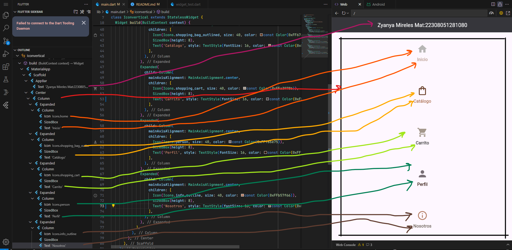

# Icono verticales

 Insertar 5 íconos con subtítulo en una columna de manera vertical.
 Nota: Los íconos tienen que ver con su negocio, todos los íconos de diferente color, inclusive los subtítulos

